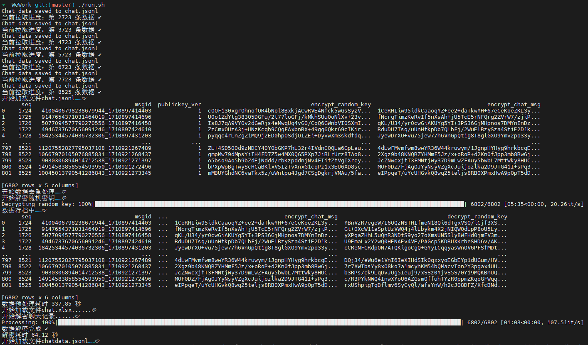
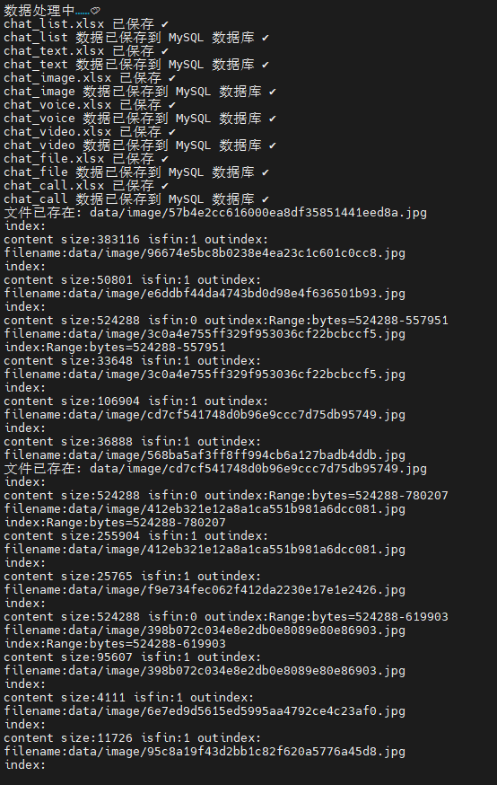

# 会话内容存档

基本使用说明：

- https://zhuanlan.zhihu.com/p/597147920
- https://developer.work.weixin.qq.com/document/path/91360

本项目为基于企业微信提供的C_sdk，进行会话记录数据的获取、媒体数据的获取，仅针对Ubuntu系统和WSL做过部署测试，因为项目代码由chatGPT 自动生成的，显的碎片化，欢迎优化。

## openssl

配置会话存档需要按照API文档设置消息加密公钥，可以使用以下指令生成：

```
# 生成私钥
openssl genrsa -out private.pem 2048
# 从私钥产生公钥
openssl rsa -in private.pem -pubout -out public.pem
```

在Windows下，可以使用以下choco指令安装openssl：

```
# Windows
choco install openssl.light
```

> 提示：请把生成的`private.pem`和`public.pem`复制到本项目根目录下。

## sdktools

### 配置企业的corpid与secrectkey

修改[C_sdk](https://developer.work.weixin.qq.com/document/path/91774)中`sdktools.cpp`企业微信配置：

```c
    ret = init_fn(sdk, "wwd08c8e7c775ab44d", "zJ6k0naVVQ--gt9PUSSEvs03zW_nlDVmjLCTOTAfrew");
```

然后复制`libWeWorkFinanceSdk_C.so`到`/usr/local/lib/`并编译sdktools：

```
g++ sdktools.cpp -ldl -o sdktools
```

提示：`sdktools.cpp` 相对 `tool_testSdk.cpp`修改了以下部分内容从显示为保存到jsonl文件：

1. 修改`sdktools 1`获取会话记录数据为保存会话数据到chat.jsonl文件：

```c
        printf("GetChatData len:%d data:%s\n", chatDatas->len, chatDatas->buf);
```
改为
```c
        // 保存到文件
        FILE* file = fopen("chat.jsonl", "a");
        if (file != NULL) {
            fprintf(file, "%s\n", chatDatas->buf);
            fclose(file);
            printf("Chat data saved to chat.jsonl\n");
        } else {
            printf("Failed to open file\n");
        }
```

2. 修改`sdktools 3`显示解密的消息明文为保存消息明文文本到chatdata.jsonl文件：

```c
        printf("chatdata :%s ret :%d\n", Msgs->buf, ret);
```
改为
```c
        // 保存到文件
        FILE* file = fopen("chatdata.jsonl", "a");
        if (file != NULL) {
            fprintf(file, "%s\n", Msgs->buf);
            fclose(file);
            printf("Chat data saved to chatdata.jsonl\n");
        } else {
            printf("Failed to open file\n");
        }
```

3. 修改了`sdktools 2`参数顺序，把保存文件的参数提前，避免不需要代理配置时使用的麻烦。

### 用法

sdktools指令用法如下：

```c
//seq 表示该企业存档消息序号，该序号单调递增，拉取序号建议设置为上次拉取返回结果中最大序号。首次拉取时seq传0，sdk会返回有效期内最早的消息。
//limit 表示本次拉取的最大消息条数，取值范围为1~1000
//proxy与passwd为代理参数，如果运行sdk的环境不能直接访问外网，需要配置代理参数。sdk访问的域名是"https://qyapi.weixin.qq.com"。
//建议先通过curl访问"https://qyapi.weixin.qq.com"，验证代理配置正确后，再传入sdk。
//timeout 为拉取会话存档的超时时间，单位为秒，建议超时时间设置为5s。
//sdkfileid 媒体文件id，从解密后的会话存档中得到
//savefile 媒体文件保存路径
//encrypt_key 拉取会话存档返回的encrypt_random_key，使用配置在企业微信管理台的rsa公钥对应的私钥解密后得到encrypt_key。
//encrypt_chat_msg 拉取会话存档返回的encrypt_chat_msg
```
```
./sdktools 1(chatmsg) 2(mediadata) 3(decryptdata)
./sdktools 1 seq limit proxy passwd timeout
./sdktools 2 fileid savefile proxy passwd timeout
./sdktools 3 encrypt_key encrypt_chat_msg
```

> 注：获取会话记录内容不能超过5天，如果企业需要全量数据，则企业需要定期拉取聊天消息。返回的ChatDatas内容为json格式。

提示：**推荐直接`./run.sh`一键处理数据**，或者把此脚本加入计划任务中每日定期执行

> 注意需在`.env`中配置数据库，具体请参考`.env.example`文件

## python脚本说明

    python3 -m pip install pycryptodome

### WxChat.py

封装的类，提供从数据获取到解密格式化的所有功能，直接把chat.jsonl转为chatdata.jsonl。

对应分步执行脚本为以下文件：

- 1_GetData

自动从头拉取聊天记录并保存至`chat.jsonl`

    python GetData.py

- 2_Data2Excel

把拉取的聊天记录转为excel格式

    python Data2Excel.py chat.jsonl

- 3_chatData

解密聊天记录并转存为`chatdata.jsonl`

    python chatData.py chat.xlsx

### chatMsg

把解密的聊天记录格式化处理为`chat_<msgtype>.xlsx`

    python chatMsg.py chatdata.jsonl

如果开启了数据库配置还会自动分表保存数据到数据库中，目前只处理了`['text', 'image', 'voice', 'video', 'file', 'call']`类型的消息。另外代码没有为数据表配置自增ID，有需要可以自行在数据库中添加。

```sql
# 添加自增ID，一共有chat_list、chat_text、chat_image、chat_voice、chat_video、chat_file、chat_call共7张表
ALTER TABLE chat_list
ADD COLUMN id INT AUTO_INCREMENT PRIMARY KEY FIRST;
```

### getFile

根据转换后的聊天记录获取图片、语音、文件等内容，使用md5sum为文件名，避免文件重复下载。

    python getFile.py

----

提示：**推荐直接`./run.sh`一键处理数据**，或者把此脚本加入计划任务中每日定期执行。



